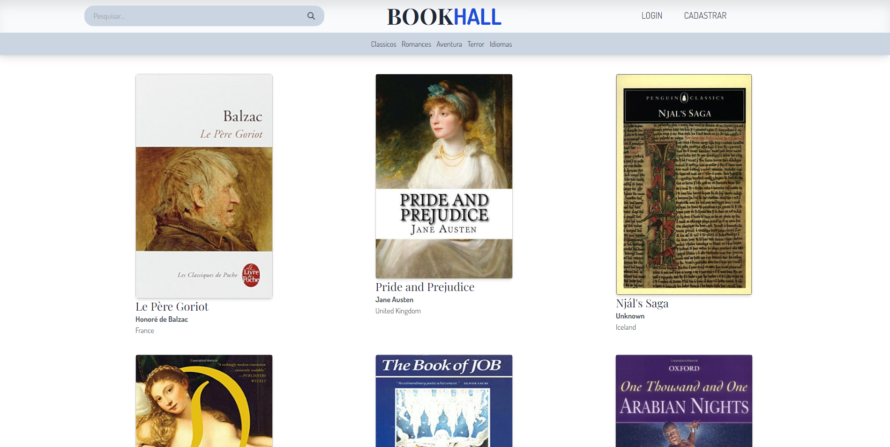

 
 
          
 
                 

<h3 align="center">Library BookHall</h3>

---

## Sumário
- [Regras de Negócio](#backend)
- [Backend](#backend)
	- [Tecnologias](#tecnologias_back)
	- [Rotas](#rotas)
- [Frontend](#frontend)
	- [Tecnologias](#tecnologias_front)
	- [Funcionamento](#funcionamento_front)
- [Executar Projeto](#executar)

## Regras de Negócio 
Site de livraria.
- Homepage exibindo os livros
- Usuario pode se cadastrar e efetuar login
- Listar Livros
- Apenas o admin pode cadastrar, editar e excluir livros.
- Usuario pode adicionar e remover livro da sua conta. 

## BackEnd
### lib's utilizadas: 

- node 16.17.0
- express
- passport - jwt 
- jsonWebToken
- Multer
- Mongoose
- MongoDB

### Funcionalidades 

O projeto é dividido nas seguintes rotas:

**/book**: 

Para utilizar as rotas de POST, PUT, DELETE é necessário que o user seja admin e fornecer token JWT valido.

- `/book` (GET, POST)
- `/book/:id` (GET, PUT, DELETE)

**/user**:

Para utilizar as rotas de POST, PUT, DELETE é necessário fornecer token JWT valido. Campos POST: name, password, role?: ["USER" | "ADMIN"] 

- `/user` (GET, POST)
- `/user/:id` (GET, PUT, DELETE)
- `/user/:id/buy` (PUT) body: [{id: ""}]
- `/user/:id/buy` (DELETE)

**/auth**:

- `/auth/login` (POST)
- `/auth/refreshtoken` (POST) body: {refreshtoken: ""}

**imagens**:
  As imagens podem ser visualizadas pela rota:
  - `/<nomeDaImagem>` (GET)

As rotas podem ser testadas utilizando a interface gráfica do frontend. O projeto tambem acompanha um esquema das rotas que pode ser utilizado no postman.

## FrontEnd 

### lib's utilizadas: 

- node 16.17.0
- Angular
- scss
- tailwind
- font awesome

## Funcionamento 

**Estrutura do Projeto:**

- `./pages`: são todas as páginas disponiveis para acesso
- `./components`: Todos os componentes e utilizados nas páginas
- `./services`: Possui funções responsaveis por armazenar as rotas e interargir com a API
- `./styles`: Onde fica localizado as variaveis globais de estilo.
- `./helpers`: Onde fica todas as funções e arquivos de ajuda, como por exemplo funções responsaveis por colocar maskara.

## Como executar Projeto ? 

#### Rodar Backend

- Executar `nest start`

#### Rodar Frontend

- Executar `ng serve`
